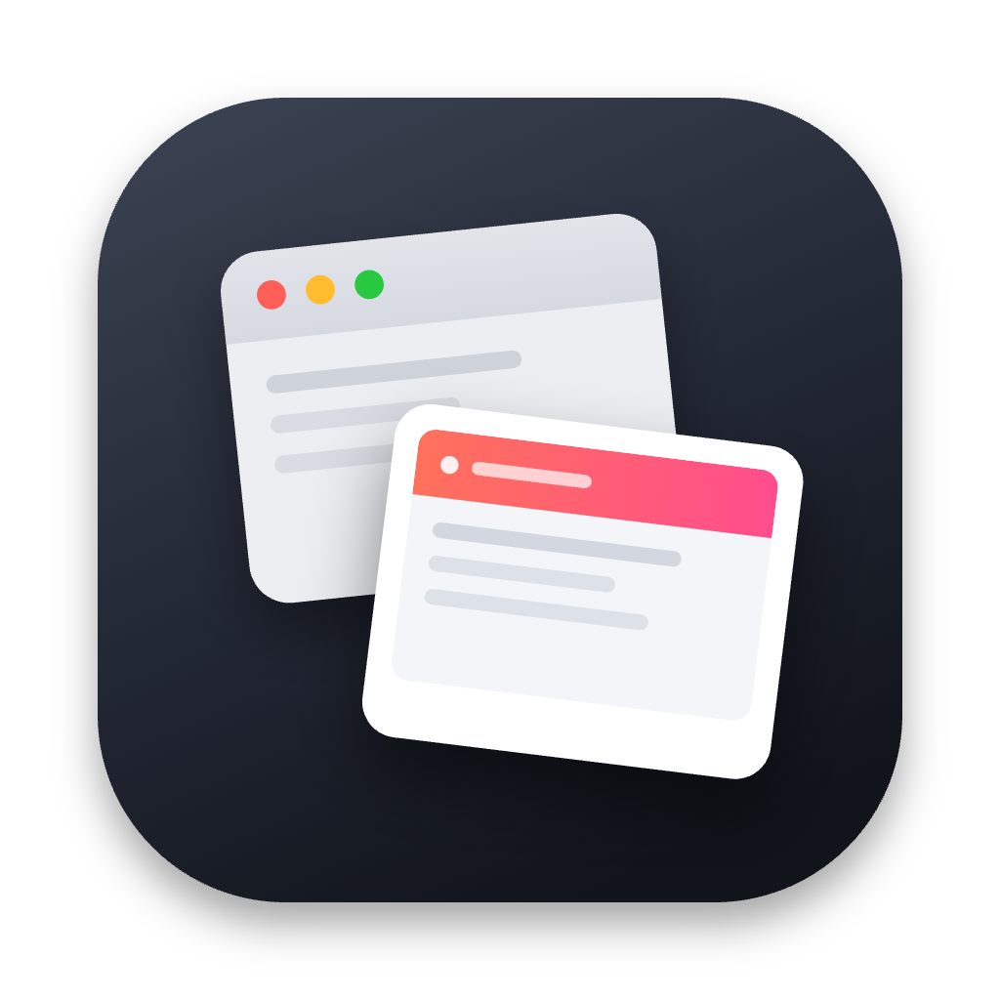

<div align="center">



# PrtScn

**The Print Screen key your Mac never had.**
A fast, native, menu-bar screenshot utility for macOS —
capture, annotate, and ship without ever touching a Dock icon.


</div>

---

PrtScn takes its name from the old keyboard's **Print Screen** key — the one
that promised exactly this and delivered a full-screen dump to nowhere. This
is that key, done right: it lives quietly in your menu bar and gets out of
the way. Fire a global shortcut, grab a region / window / the whole screen,
and a preview pops up right next to your cursor — copy it, save it, or drop
straight into a built-in editor to annotate before it ever touches your
clipboard. No third-party dependencies, no telemetry, no background daemon
eating your battery — just system frameworks, doing exactly what you asked.

## Highlights

- 🖱️ **Capture Area, Window, or Full Screen**, bound to your own global
  shortcuts (Carbon hotkeys — no Accessibility permission required).
- 🪄 **Cursor-anchored preview** with Copy / Save / Edit / Copy Text (OCR),
  a hover-to-pause auto-dismiss countdown, and drag-to-export straight from
  the thumbnail.
- ✏️ **In-app annotation editor** — arrow, line, measure (reports the
  capture's *true* pixel dimensions, not the on-screen render size),
  rectangle, rounded rectangle, ellipse, pixelate/redact, step counter,
  text, a live eyedropper color picker, crop, and full undo/redo.
- 🪟 **Shottr-style window backgrounds** — margins with a drop shadow, a
  solid color, your actual desktop wallpaper, or a tight trim — for
  screenshots that already look presentation-ready.
- 📌 **Pin to screen** — float any capture in an always-on-top window: drag
  it anywhere, scroll to resize, and keep as many pinned as you like while
  you work.
- 🔍 **Copy Text (OCR)** straight out of any capture, powered by Vision.
- 🚀 **Launch at login**, a native macOS 26 Liquid Glass interface, and a
  menu bar you'll forget is even running.

## Download

Grab the latest signed build from the
**[Releases page](https://github.com/nx-alejandrolacasa/prtscn/releases/latest)**.

> These builds aren't notarized by Apple, so Gatekeeper blocks them on first
> launch. Either **right-click PrtScn → Open** and confirm the dialog, or run
> `xattr -cr /Applications/PrtScn.app` once in Terminal.

## Building from source

### Requirements

- macOS 26+
- Swift 6 toolchain (Xcode **or** Command Line Tools — `xcode-select --install`)

### Build & run

```sh
./build.sh        # compile + assemble build/PrtScn.app
./build.sh run    # also (re)launch it
```

Or open the bundle manually:

```sh
open build/PrtScn.app
```

The app has **no Dock icon** — look for the camera (`􀌞`) icon in the menu bar.

On the first capture, macOS will ask for **Screen Recording** permission
(System Settings → Privacy & Security → Screen Recording). This is required for
`screencapture` to produce non-blank output.

## Sign once, grant once (stop the repeated permission prompts)

By default the build is **ad-hoc** signed, whose identity changes on every
build — so macOS treats each rebuild as a new app and re-asks for Screen
Recording permission. Create a **stable self-signed certificate once** and the
grant sticks across all future builds.

**One-time setup (≈1 min):**

1. Open **Keychain Access** (⌘-Space → "Keychain Access").
2. Menu bar → **Keychain Access → Certificate Assistant → Create a Certificate…**
3. Fill in:
   - **Name:** `PrtScn Dev`  ← must match exactly
   - **Identity Type:** Self-Signed Root
   - **Certificate Type:** Code Signing
4. Click **Create** → Continue through the warning → **Done**.

Verify it's there:

```sh
security find-identity -v -p codesigning   # should list "PrtScn Dev"
```

Now `./build.sh` signs with it automatically. The next build will prompt for
Screen Recording **one last time** (new identity) — grant it, and you won't be
asked again. If old `PrtScn` entries linger in **System Settings → Privacy &
Security → Screen Recording**, remove them and keep the new one.

> Want a different cert name? `PRTSCN_SIGN_IDENTITY="My Cert" ./build.sh`.

> For the full file-by-file layout, see [`CLAUDE.md`](CLAUDE.md).

## Releasing

Push a version tag (`vX.Y.Z`) and GitHub Actions takes it from there — builds
the app, packages a DMG, and publishes a GitHub Release with install
instructions attached. See `.github/workflows/release.yml`.

## Roadmap

See [`ROADMAP.md`](ROADMAP.md).
